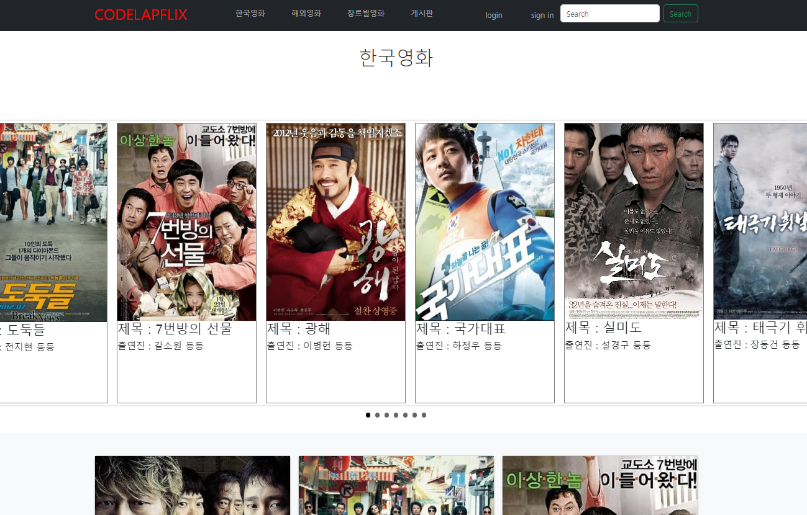
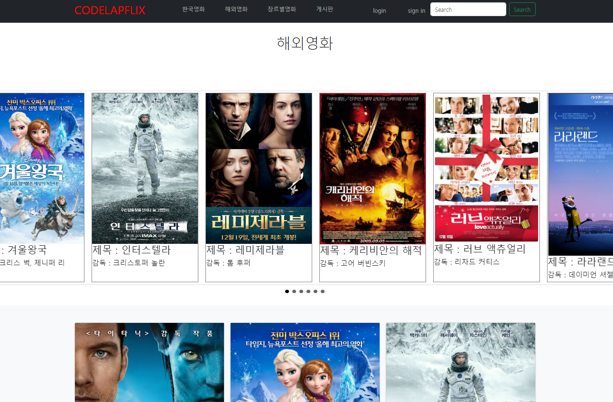
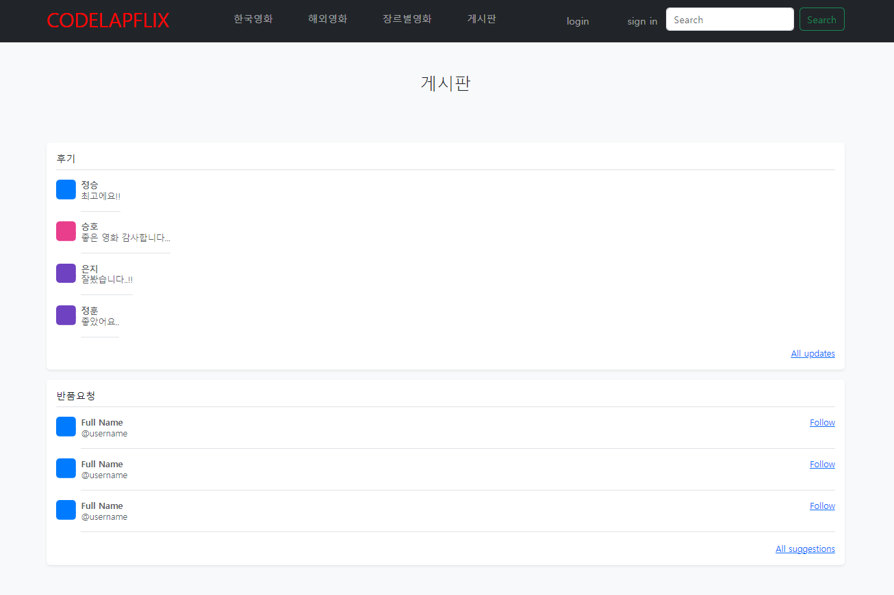

# CodeLab-Movie 
## 목차

### 팀원소개
    
 |  이름  | 보유기술 | 개발환경 | 
|--------|----------|----------|
| 정승호 |    HTML, javascript, css    |    IntelliJ IDEA , vim      | 
| 이정훈 |    HTML, javascript, css    |    IntelliJ IDEA , vim      |  
| 김정승 |    HTML, javascript, css    |    IntelliJ IDEA , vim      |  
| 배은지 |    HTML, javascript, css    |    IntelliJ IDEA , vim      |   
    
### 프로젝트개요
+ 기간 : 2024.01.12(금) ~ 2024.01.18(목)
+ 주제 : 테마별로 영화를 소개하고 추후 구매 및 스트리밍 서비스를 제공하는 웹서비스

### 담당업무

* 정승호 -  
    + 영화 장르별 포스터 사진파일 다운로드 후 배열에 저장
    + 영화 예고편 url 주소 다운로드 후 배열에 저장
    + 영화 줄거리 소개하는 텍스트파일 다운로드 후 배열에 저장
   ***
* 이정훈 -  
    + 영화 장르별 포스터 사진파일 다운로드 후 배열에 저장
    + 영화 예고편 url 주소 다운로드 후 배열에 저장
    + 영화 줄거리 소개하는 텍스트파일 다운로드 후 배열에 저장
   *** 
* 김정승 - 
    + chatBot 개발 및 프로그램 구성</br>
    + chatbot 자연어 검색
    + data를 sort 후 jQuery 를 이용해서 배표 
     ```javascript
         
        function calculateSimilarity(str1, str2) {
            var totalLength = 0;
            var similarityPercentage = 0;
            var minLength = 0;
            var matchCount = 0;
  
            var strSplit = str2.split(" ");
            if(strSplit === 1) {
                for (var j = 0; j < strSplit[0].length; j++) {
                    minLength = Math.min(str1.length, strSplit[0].length);
                    if (str1[j] === strSplit[0][j]) {
                      matchCount++;
                    }
                }
                if(matchCount >= 2) {
                    totalLength = (str1.length + strSplit[0].length - matchCount) / 2;
                    similarityPercentage = (matchCount / totalLength) * 100;
                    matchCount = 0;
                }else{
                    matchCount = 0;
                }
            }else{    
                for(var j = 0; j < strSplit.length ; j++) {
                    minLength = Math.min(str1.length, strSplit[j].length);
                    for (var i = 0; i < minLength; i++) {
                       if (str1[i] === strSplit[j][i]) {
                           matchCount++;
                        }
                    }
                    if(matchCount >= 2){
                        totalLength = (str1.length + strSplit[j].length - matchCount) / 2;
                        similarityPercentage = (matchCount / totalLength) * 100;
                        matchCount = 0;
                        break;
                    }
                }
            }    
            return similarityPercentage;
        }
    ```

    ```javascript

        var logfile = logFile.split(",");
        var category;
        for(var i=0; i < movieArray.length; i++){
            // alert(logfile[logfile.length-1]);
            if(movieArray[i][1].toLowerCase().includes(logfile[logfile.length-1])){
                // alert("hello")
                category = movieArray[i][6];
                break;
            }
        }
        var arrayWithIndices = movieArray.map(function (row, index){
            return {data:row, index:index};
        });
        arrayWithIndices.sort(function (a,b){
            return b.data[7] - a.data[7];
        });
    ```
   ***
* 배은지 - 
    + 자료조사 
    + 프론트 디자인 

### 주요기능 
* 정승호 -
  + sort 기능을 이용하여 카테고리별로 보여질 수 있는 기능 개발
  + chart 를 개발  
   ***
* 이정훈 -  
  + 배열에 영화 별 사진, url 주소, 줄거리 소개 입력 후
  + 메인 페이지에서 해당 정보를 끌어다 쓸 수 있게 저장 함



         
   *** 
     -김정승 - 
    
   ***
     -배은지 - 
         + 자료조사 
         + 프론트 디자인


### 향후과제
    + 프로젝트 과제

    + 조원별 개인 과제
    
     -정승호 -  
   ***
     -이정훈 -  
         jQuery 함수 사용에 미흡함을 느낌
         전반적인 프로젝트 완성에 도움을 못 줌
         jQuery 문법에 능통한 개발 능력을 갖추기를 희망함
   *** 
     -김정승 - 
   ***
     -배은지 - 
         전체적인 퀄리티를 업그레이드, 프론트에만 포커스를 맞춘 웹을 백엔드 부분도 접목시켜 현실적인 구동능력을 넣고싶습니다.
